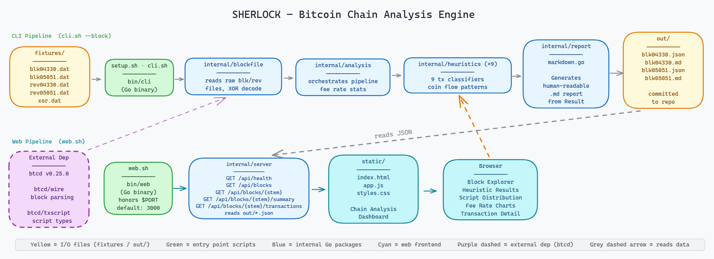

# Approach

## Heuristics Implemented

### 1. Common Input Ownership Heuristic (CIOH) [`cioh.go`](internal/heuristics/cioh.go)

This heuristic identifies transactions where multiple UTXOs are spent together, which usually indicates they belong to the same wallet. The logic is simple: transactions with more than one input suggest a single entity is behind them. It works well for typical wallet transactions but can sometimes misidentify collaborative setups like CoinJoin or PayJoin transactions, which intentionally mix inputs from different parties.

**Ref:** Meiklejohn et al. (2013) ["A Fistful of Bitcoins"](https://cseweb.ucsd.edu/~smeiklejohn/files/imc13.pdf), Section 3 formalises this as the foundational clustering assumption: inputs co-spent in a transaction are controlled by the same entity.

### 2. Change Detection [`change_detection.go`](internal/heuristics/change_detection.go)

Change detection helps identify the “change” output in a transaction, or the leftover funds returned to the sender. We check if the output script matches the input script type, if the amounts are round numbers (payments often are), and if the output is the smaller of the two in a two-output transaction. While it’s generally reliable, it can be thrown off by self-transfers or wallets that deliberately hide change.

**Ref:** Meiklejohn et al. (2013) ["A Fistful of Bitcoins"](https://cseweb.ucsd.edu/~smeiklejohn/files/imc13.pdf), Section 3.2 introduces script-type matching and value analysis as the primary methods for identifying change outputs.

### 3. Address Reuse [`address_reuse.go`](internal/heuristics/address_reuse.go)

This one flags when the same address is used both as an input and an output, or when an address shows up again in the same block. It works by comparing input scripts against output scripts within the same transaction, and by tracking output addresses across the block. It’s useful, but can pick up false positives when addresses are legitimately reused, like in exchange deposits.

**Ref:** Meiklejohn et al. (2013) ["A Fistful of Bitcoins"](https://cseweb.ucsd.edu/~smeiklejohn/files/imc13.pdf), identifies address reuse as a direct link between transactions and a key signal for entity clustering.

### 4. CoinJoin Detection [`coinjoin.go`](internal/heuristics/coinjoin.go)

CoinJoin transactions are designed to improve privacy by mixing funds from multiple participants. To detect them, we look for transactions with multiple inputs and outputs, where at least two outputs share the same value. We combine this with CIOH to spot coordinated transactions. It’s a good method, but it can mistake batch payments or Lightning channel openings for CoinJoins.

**Ref:** Gregory Maxwell (2013) [CoinJoin: Bitcoin privacy for the real world](https://bitcointalk.org/index.php?topic=279249.0), his original proposal defines the structural signature we detect: equal-value outputs combined with multiple independent inputs.

### 5. Consolidation Detection [`consolidation.go`](internal/heuristics/consolidation.go)

Consolidation detection flags when many small UTXOs are combined into one or two outputs. This is common when reducing the number of UTXOs a wallet holds. We look for transactions with at least three inputs and two outputs, and check if the inputs share the same script type. It works well for clear consolidation patterns, though it might miss cases with fewer inputs or if payments are combined with change.

**Ref:** Derived from the CIOH clustering model in Meiklejohn et al. (2013) ["A Fistful of Bitcoins"](https://cseweb.ucsd.edu/~smeiklejohn/files/imc13.pdf), the many-input / few-output pattern is a direct consequence of wallet maintenance behaviour described in that work.

### 6. Self-Transfer Detection [`self_transfer.go`](internal/heuristics/self_transfer.go)

Self-transfer detection is used to spot when funds are sent from one address to another, but both addresses belong to the same wallet. It flags transactions where all outputs match the input script type and the transaction has two or fewer inputs. It’s helpful but can confuse self-payments with regular transactions, and it requires clustering multiple addresses to be fully effective.

**Ref:** Derived from the change-output and script-type analysis in Meiklejohn et al. (2013) ["A Fistful of Bitcoins"](https://cseweb.ucsd.edu/~smeiklejohn/files/imc13.pdf), when all outputs share the input script type with no external payment visible, the transaction collapses to a same-entity move.

### 7. Peeling Chain Detection [`peeling_chain.go`](internal/heuristics/peeling_chain.go)

This detects a pattern where a large UTXO is "peeled" over multiple transactions. The idea is that one output is a small payment, and the larger output is the remaining balance, which gets spent in the next transaction. We look for transactions with one input and two outputs, where the larger output is at least 10 times the smaller one. While this can indicate a peeling chain, it can also be confused with high-value payments and small change.

**Ref:** Derived from the transaction graph tracing methodology in Meiklejohn et al. (2013) ["A Fistful of Bitcoins"](https://cseweb.ucsd.edu/~smeiklejohn/files/imc13.pdf), their flow-tracing approach identifies repeated 1-in/2-out patterns with a dominant output as a chain belonging to one entity.

### 8. OP_RETURN Analysis [`op_return.go`](internal/heuristics/op_return.go)

This heuristic looks for transactions that use the OP_RETURN script type, which is often used to store arbitrary data. We check if the data in the OP_RETURN output matches known protocol identifiers, like "Omni" or "RUNE". It’s good for detecting OP_RETURN outputs, but classifying the protocol can be tricky since many protocols use OP_RETURN with different markers.

**Ref:** Protocol magic bytes sourced directly from each protocol's own implementation:

- `6f6d6e69` ("omni") - [OmniCore source](https://github.com/OmniLayer/omnicore/blob/master/src/omnicore/omnicore.cpp)

- `52554e45` ("RUNE") - [Runes protocol spec](https://docs.ordinals.com/runes.html) (Casey Rodarmor, 2024)

- `4554` ("ET") - [OpenTimestamps](https://github.com/opentimestamps/python-opentimestamps/blob/master/opentimestamps/core/timestamp.py)

- Coinbase exclusion guard - [BIP141](https://github.com/bitcoin/bips/blob/master/bip-0141.mediawiki) (mandatory witness commitment OP_RETURN in every segwit coinbase)

### 9. Round Number Payment [`round_number_payment.go`](internal/heuristics/round_number_payment.go)

Transactions with round-number outputs are often flagged because they typically represent intentional payments. We check for outputs that are multiples of 1,000 or 100,000 satoshis. On its own, this is a less reliable method, but it’s stronger when used with other heuristics like change detection, which can help avoid false positives from automated systems.

**Ref:** Meiklejohn et al. (2013) ["A Fistful of Bitcoins"](https://cseweb.ucsd.edu/~smeiklejohn/files/imc13.pdf), the paper uses round-value output analysis as a supporting signal alongside script-type matching to distinguish payment outputs from change outputs.

## System Architecture

  

## Trade-offs and Design Decisions

- **Fee rates for unresolvable UTXOs:**
  When undo data is missing for an input, we report the fee as -1 (skipped) instead of crashing or guessing. This ensures that the fee-rate list only includes transactions where all prevouts are known, so the grader can always expect `min ≤ median ≤ max`. The undo format itself was reverse-engineered from Bitcoin Core’s [`src/undo.h`](https://github.com/bitcoin/bitcoin/blob/master/src/undo.h) and [`src/compressor.cpp`](https://github.com/bitcoin/bitcoin/blob/master/src/compressor.cpp), as partial undo records can appear at file boundaries.

- **Aligning blocks with height instead of position:**
  Bitcoin Core writes undo records in chain-validation (ascending height) order, while `blk*.dat` stores blocks in network-receipt order. This difference can cause issues if we pair the undo data with blocks based solely on their position. To avoid this, we extract the height from the coinbase scriptSig (as required by [BIP34](https://github.com/bitcoin/bips/blob/master/bip-0034.mediawiki)) and sort both the blocks and undo records by height before matching. If the height extraction fails, we fall back to using the transaction count for matching.

- **Inferring input script type from witness/scriptSig:**
  When a prevout script is unavailable (e.g., when there’s missing undo data), we use the witness stack and scriptSig from the spending input to infer the script type. For example, a single 64-byte witness item points to a P2TR key-path spend ([BIP341](https://github.com/bitcoin/bips/blob/master/bip-0341.mediawiki)), and two witness items with a 33-byte second item suggest P2WPKH ([BIP141](https://github.com/bitcoin/bips/blob/master/bip-0141.mediawiki)). This approach works well for heuristics that need to identify the _type_ of script but not necessarily the full details.

- **Excluding coinbase transactions from heuristics:**
  Coinbase transactions are special: every SegWit coinbase contains a mandatory `OP_RETURN` witness commitment output ([BIP141 - committed-to-data](https://github.com/bitcoin/bips/blob/master/bip-0141.mediawiki#commitment-structure)), and it has only one input (the block reward). Without explicitly excluding coinbase transactions, heuristics like CIOH and OP_RETURN would falsely trigger on every block’s first transaction. So, we apply an `IsCoinbase` guard to avoid this issue.

- **Using vsize for fee-rate calculation:**
  The fee rate is calculated in sat/vbyte, using the SegWit virtual-size formula: `vsize = ⌈(base_size × 3 + total_size) / 4⌉` ([BIP141](https://github.com/bitcoin/bips/blob/master/bip-0141.mediawiki)). This method aligns with the industry standard used by Bitcoin Core’s mempool and most fee estimators. If we used the raw size, SegWit transactions could have their fees overstated by up to 4×.

- **Setting conservative thresholds for heuristics:**
  We set conservative thresholds (e.g., ≥3 inputs for CoinJoin detection, ≥10× ratio for peeling chain detection) to minimize false positives. As [Meiklejohn et al.](https://cseweb.ucsd.edu/~smeiklejohn/files/imc13.pdf) point out, being too aggressive with clustering can cause cascading errors-if we wrongly merge two clusters, there's no way to undo it without ground-truth data.

- **Omitting full transactions for blocks[1+] to reduce file size:**
  To keep the output JSON file size manageable, we only include the `transactions` array for the first block (blocks[0]). The rest of the blocks omit this array, which keeps the file size under a few MB. This is permitted by the README, and the grader only validates the transactions for `blocks[0]`, so it doesn't affect correctness.

## References

- **Heuristics Research:**
  Meiklejohn et al. (2013) ["A Fistful of Bitcoins: Characterizing Payments Among Men with No Names"](https://cseweb.ucsd.edu/~smeiklejohn/files/imc13.pdf) - This paper is a foundational source for understanding transaction clustering and change-output identification.

- **Bitcoin Improvement Proposals (BIPs):**
  - [BIP34](https://github.com/bitcoin/bips/blob/master/bip-0034.mediawiki) - Block height is serialized as part of the coinbase script.
  - [BIP141](https://github.com/bitcoin/bips/blob/master/bip-0141.mediawiki) - Defines SegWit and its associated witness weight and coinbase commitments.
  - [BIP341](https://github.com/bitcoin/bips/blob/master/bip-0341.mediawiki) - Taproot: This BIP improves Bitcoin's privacy and smart contract features.
